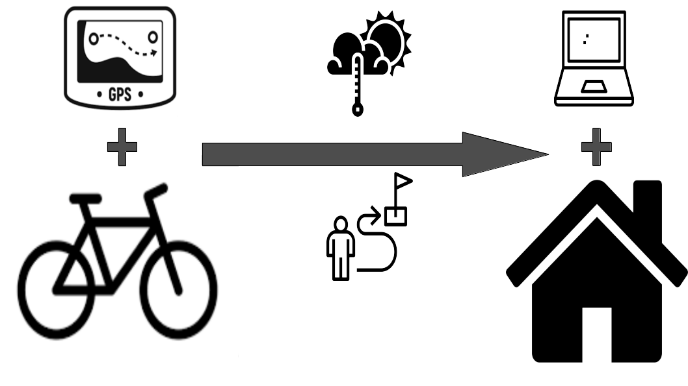
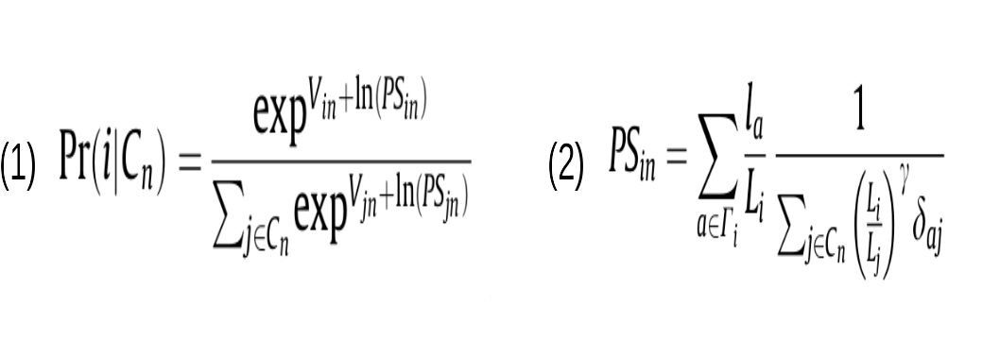

layout: true
  
<div class="my-footer"><span>

<a href="https://www.sciencedirect.com/science/article/pii/S0965856412001164">Fonte: Where do cyclists ride? A route choice model developed with revelead preference GPS data</a>

</span></div> 
---
class:

```{r setup, include=FALSE}
options(htmltools.dir.version = FALSE)

knitr::opts_chunk$set(fig.align = "center", message=FALSE, warning=FALSE)

library(tidyverse)

```

# Introdução

## <center><b>Que tipos de infraestrutura e políticas podem aumentar os níveis de uso da bicicleta para transporte e em quanto?</b></center> 

```{r, echo=FALSE, out.width="25%"}
knitr::include_graphics("https://media.giphy.com/media/3o84Ufy4oR2l0nSdEs/giphy.gif")
```

Decisões de interesse: 
- onde investir
- que tipo de intervenção / instalação priorizar

---
class:

# Introdução - Estudos anteriores

## Agregados
Indicaram correlação posistiva entre ciclovias e níves de utilização de bicicletas

## Desagregados ao nível do indivíduo

##### De preferência relevada
Há achados contraditórios:  alguns indicam correlação entre andar de bicicleta e proximidade de infraestrutura dedicada ou que ciclistas valorizam essa condições, outros não indicam o mesmo.

##### De preferência declarada
Em geral, há maior preferência por infraestrutura dedicada.
Mas <u>as preferências variam segundo características individuais</u>, como por exemplo, experiência e gênero (mulheres e ciclistas menos experientes preferem mais as estruturas segregadas e evitar grandes volumes de tráfego e altas velocidades).

---
class:

# Introdução - Estudos anteriores

## Crítica #1

Modelos da América do Norte: não incluem bicicleta em todas as etapas¹ do processo modelagem e planejamento de transportes.

<b>Quando o modo bicicleta chega a ser considerado, é comum assumir que ciclistas escolhem o caminho da distância mínima entre as origens e os destinos usando uma velocidade fixa de deslocamento.</b>

Porém, essa abordagem ignora: 
- aclives/declives;
- volumes de tráfego;
- presença de ciclovias dentro e fora da rua;
- diferentes motivos de viagem.


.footnote[
<i>¹ Referente ao modelo 4 etapas clássico: geração de viagens, distribuição de viagens, divisão modal e alocação de viagens (rotas)</i>
]

---
class:

# Introdução - Estudos anteriores

## Crítica #2

<b> Método de coleta de dados dominante é o de preferência declarada</b>

- Mais simples: entrevistados(as) classificam diferentes tipos de instalações / (infra)estruturas segundo suas preferências
- Mais sofisticados: opções de rota são oferecidas lado a lado para escolha, de foram a forçar o(a) respondente a trocar recursos presumivelmente positivos

<!-- ##### Vantagens: -->
<!-- - a coleta de dados geralmente é mais fácil e/ou mais barata -->
<!-- - não é preciso resolver o problema de gerar rotas alternativas em uma rede real -->
<!-- - especificar e estimar o modelo é mais simples (dados "limpos" e nº limitado de alternativas) -->

##### Desvantagens:

- Até que ponto o(a) participante "traduz" as representações textuais ou pictóricas para suas preferências por instalações reais? 
- É provável que os(as) entrevistados(as) tenham em mente suas próprias rotas habituais como pontos de comparação
- É possível que se os(as) participantes acharem que as respostas podem influenciar os resultados das políticas eles(as) alterem suas reais preferências 

---
class:

# Métodos

## Tecnologias
- ArcGis
- Python
- [Biogeme](https://biogeme.epfl.ch/)
<!-- O Biogeme é um pacote Python de código aberto projetado para a estimativa de probabilidade máxima de modelos paramétricos em geral, com ênfase especial em modelos de escolha discreta. -->

## Fontes de dados oficiais
- Oregon Metro: rede base oficial, instalações para bikes, interseções e restrições de direção
- Cidade de Portland: volume de tráfego (contagens automatizadas)

## Rede construída para a pesquisa
- 66 mil nós
- 88 mil links (não direcionais)  - A rede foi enriquecida com links não comumente usados para modelar viagens - informais e não mapeados


---
class:

# Métodos

- <b>Preferência revelada</b>: utiliza dados reais de rede e rotas
- <b>Quem</b>: 164 ciclistas que pedalavam mais de 1 dia na semana foram recrutados(as) <BR> (154 considerados)
- <b>Quando</b>: coleta de março a novembro de 2007
- <b>Como</b>: dados de geolocalização coletados a cada 3s (GPS)
- <b>Onde</b>: Portland (OR) (EUA)

<BR>
```{r echo=FALSE, fig.cap="<center><b>Esquema de coleta de dados</center></b>", out.width="60%"}

```

---
class:

# Métodos - Amostra

Participantes reponderam a survey antes da coleta de dados com:
- questões sócio-econômicas
- padrões de viagem
- atitudes em relação à bicicleta

Vieses (em relação à população):
- <b>utilização da bibicleta como meio de transporte</b>²
- <b>preferência para ciclistas que tinham opção de dirigir</b> (7% sem carro)
- mais mulheres que a proporção de mulheres ciclistas na população (44% mulheres)
- em média, mais velhos (89% com idade entre 25 e 64 anos)
- em média, mais escolarizados
- em média, mais ricos
- mais frequentemente com empregos formais em período integral
- mais frequentemente com estrutura familiar composta por 2 pessoas
<br></br>

.footnote[
<i>² Ao final foram excluídas 10 pessoas que só andaram de bicicleta para fazer atividades físicas.</i>
]

---
class:

# Métodos - Rotas

## Geração do conjunto de rotas possíveis - tarefa complexa
- tamanho e densidade da rede ciclável de Portland
- falta de estudos de preferência revelada na escolha de rotas de bicicleta
- tempos de viagem de bicicleta não são afetados por limites de velocidade, congestionamentos e hierarquia viária da mesma maneira que os tempos de viagem de carros

## Métodos de escolha testados:
- <i>K-shortest paths</i>
- <i>simulated shortest paths</i>
- <i>route labeling</i>

<br><b>Nenhum desses métodos foi satisfatório .: desenvolveram uma variação do <i>route labeling</i></b></br>


---
class:

# Métodos - Rotas

## Especificações do modelo

Modelo logit da probabilidade <i>Path Size</i> [Eq. (1)]

```{r echo=FALSE, out.width="50%"}

```

Rota i dado o conjunto de escolhas Cn onde PS é o <i> path size factor</i> [Eq. (2)] com $\gamma = 0$

<!-- PS sempre estará entre 0 e 1, logo, ln(PS) será negativo, o que é consistente com uma redução de utilidade proporcional ao grau de sobreposição. -->

- É provável que a série de opções de rota de um indivíduo esteja correlacionada até certo ponto.
- A inclusão de múltiplos propósitos de viagem e o período geralmente curto de observação provavelmente limitam essa correlação.
- Há variação na escolha de rotas entre as viagens: não parece que os(as) ciclistas sejam "fixados" numa única rota.


---
class:

# Métodos - Escolha de rota

## Variáveis utilizadas no modelo

- proporção da rota segundo <b>inclinação média</b> (de 2 a 4%, de 4 a 6%, mais de 6%)
- <b>distância</b> percorrida e <i>Path Size</i> (modelo logit de probabilidade para escolha de rota)
- ponte com <b>infraestrtura ciclável</b> (ciclovia/ciclofaixa na rua ou instalação segregada para bicicletas)
- proporção da rota em <i>bike boulevards</i>³ e em ciclorotas fora das ruas
- proporção da rota em ruas sem ciclovia/ciclofaixa com volume de tráfego de 10k a 20k/dia, de 20k a 30k/dia  e mais de 30k/dia
- <b>sinalizações de trânsito</b> por milha (conversão à esquerda, siga em frente, pare)
- <b>conversões</b> (à esquerda e à direita) por milha
- conversão à esquerda sem sinalização de trânsito e volume de tráfego paralelo de 10k a 20k/dia e de mais de 20k/dia
- conversões à direita em cruzamentos sem sinalização cruzando ruas com volume de tráfego de mais de 10k/dia
- conversões à esquerda e e movimento retos em cruzamentos sem sinalização cruzando ruas com <b>volume de tráfego </b> de 5k a 10k/dia, de 10k a 20k/dia e de mais de 20k/dia

<!-- Obs.: As curvas à direita foram excluídas da maioria das variáveis, porque tais movimentos evitam a maioria dos conflitos e atrasos no tráfego -->

---
class:

# Resultados e discussão


- Após limpeza, foram consideradas 1449 viagens

- Média de ~2,5 viagens/dia (excluídas aquelas com finalidade para exercícios físicos)

- 30% <i>commute trips</i> (viagens casa-trabalho e trabalho-casa)
<br>  - distância média ~6km
<br>  - velocidade média ~19km/h </br>

- 70% <i>non-commute trips</i> (viagens por outros motivos)
<br>  - distância média ~3,5km
<br>  - velocidade média ~16km/h </br>

- 53% das viagens contavam com algum tipo de infraestrutura
<br>  - 29% <i>bike lanes</i> (ciclovias / ciclofaixas)
<br>  - 13% <i>off street paths</i>
<br>  - 11% <i>bike boulevards</i>³ </br>

.footnote[
<i>³ [Ruas que adotaram medidas de acalmamento de tráfego para redução de volumes e velocidades (tráfego misto). Além disso, os controles de tráfego dão prioridade a pedestres e ciclistas.](https://ruraldesignguide.com/mixed-traffic/bicycle-boulevard)</i>
]

---
class:

# Resultados e discussão - distâncias

- Tempos de viagem altamente correlacionados com distância percorrida

- Relações com caminho mais curto da rede:
<br>  - <b>Rotas observadas eram, em média, um pouco mais longas do que os caminhos mais curtos da rede</b>: 11% para viagens casa-trabalho/trabalho-casa e 12% para demais viagens
<br>  - 50% de todas as viagens observadas foram menos de 10% maiores que o caminho mais curto
<br>  - 95% de todas as viagens observadas foram menos de 50% maiores que o caminho mais curto </br>

- <b>Importa mais para os ciclistas desvios de rota relativos do que absolutos</b>:
aumento de 1% na distância reduz a probabilidade de escolher uma rota em 9% para para viagens casa-trabalho/trabalho-casa e 5% para demais viagens.

---
class:

# Resultados e discussão - conflitos

- <b>Conversões</b> provavelmente atrasam e acarretam custo mental de lembrar sequências 

- <b>Frequência de conversões é fator negativo significativo na escolha de rota</b>

- Uma conversão adicional por milha implica aumento de 4,2% na distância das viagens casa-trabalho/trabalho-casa e 7,4% nas demais viagens.

- Em geral, <b>sinalização de trânsito diminui a utilidade de uma rota</b>. 

- A sinalização de trânsito pode ser positiva para os ciclistas que desejam fazer conversões em cruzamentos movimentados:
<br>  - Em uma viagem casa-trabalho/trabalho-casa de 1 milha, um ciclista estaria disposto a desviar cerca de 5,9% do seu caminho para evitar uma travessia não sinalizada onde o tráfego cruzado era em média de 10k a 20k veículos/dia. Essa disposição sobre para 10,4% para os demais motivos de viagem.
<br>  - Em uma viagem casa-trabalho/trabalho-casa de 1 milha, um ciclista estaria disposto a desviar cerca de 9,1% do seu caminho para evitar uma conversão à esquerda em um cruzamento sem sinalização com um volume de tráfego de 10k a 20k veículos/dia. Essa disposição sobre para 16,2% para os demais motivos de viagem. </br>


---
class:

# Resultados e discussão - inclinações

- Foram testados: ganho e perda acumulada de elevação, inclinação média e máxima e algumas variáveis de inclinação não linear

- Melhor desempenho: proporção do comprimento da rota (ganho / distância) em três faixas: 2% a 4%, 4% a 6% e 6%+

- <b>Subidas diminuem a utilidade de uma rota</b>.

- Um ciclista estaria disposto a pedalar 1,72 milhas planas se a alternativa fosse 1 milha de 2 a 4% de inclinação.


---
class:

# Resultados e discussão - infraestrutura

- Controladas outras vaiáveis no modelo, houve preferência dos ciclistas por <i>off street paths</i> seguido dos <i>bike boulevards</i>.

- Para viagens casa-trabalho/trabalho-casa pedalar em <i>off street paths</i> equivale a diminuir a distância em 16,0% (26,0% para demais viagens).

- Para viagens casa-trabalho/trabalho-casa pedalar em <i>bike boulevards</i> equivale a diminuir a distância em quase 10,8% (17,9% para demais viagens).

- <b>Em ruas sem ciclovias/ciclofaixas, os ciclistas são altamente sensíveis a altos volumes de tráfego.</b>
Portland: ciclovias/ciclofaixas são quase exclusivamente nas ruas arteriais movimentadas, logo, foi difícil isolar o efeito delas do efeito do volume de tráfego. 
<!-- Elas compensam exatamente os efeitos negativos do tráfego adjacente, mas não apresentaram valor residual próprio. -->

- Para viagens não relacionadas a trabalho, as ruas com volumes de tráfego acima de 20k veículos/dia seriam usadas apenas se as alternativos de menor tráfego exigirem desvios muito longos (acima de 100%) ou houver outros impedimentos fortes, como colinas íngremes.

<!-- É improvável que um ciclista realmente escolha uma rota sete vezes mais para evitar viajar em uma rodovia sem ciclovia; o mais provável é que ele não use a bicicleta. -->

- <b>Os ciclistas eram bastante sensíveis à presença de infraestrutura ciclável nas pontes</b>.


<!-- --- -->
<!-- class: -->

<!-- # Resultados e discussão -->

<!-- - Resultados sugeriram que os valores médios dos parâmetros não eram sensíveis aos efeitos do painel, embora houvesse evidências de alguma heterogeneidade não observada nos dados. -->

<!-- - Exame mais aprofundado dos efeitos do painel e da heterogeneidade não observada foi deixado para pesquisas futuras e as viagens foram consideradas independentes para essa análise.  -->

<!-- - Diferenças de resultados de outros estudos similares podem ter ocorrido por diferença entre métodos (seleção e recrutamento da amosta, preferência declarada ou invés de revelada) e/ou entre as redes cicláveis das cidades analisadas. -->


---
class:

# Conclusões

- Este artigo descreveu o desenvolvimento de um modelo único de escolha de rotas de bicicleta com base nos dados GPS preferidos revelados.

- <i>Calibrated Labeling Method</i>: é um novo algoritmo desenvolvido para gerar conjuntos razoáveis de alternativas de rotas para viagens de biciletas.

- Mesmo os ciclistas regulares preferem rotas que reduzam a exposição ao tráfego de veículos automotores.

- O valor que os ciclistas dão aos <i>bike boulevards</i> é uma descoberta relevante: esse tipo de instalação é um conceito relativamente novo nos EUA e, portanto, não foi testado em nenhuma anterior.

- Os <i>bike boulevards</i> têm algo mais do que os atrigutos diretamentente medidos (velocidades, tráfego, etc.), talvez algo sutil como segurança percebida em números ou navegação simplificada. Isto pode trazer implicações diretas para políticas e planejamento urbano e de transportes já que são intervenções, em geral, mais baratas que ciclovias, por exemplo.
